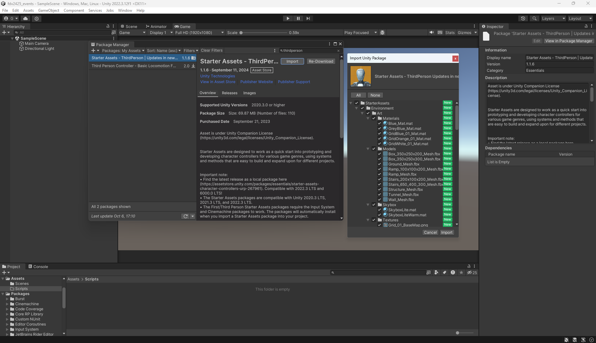
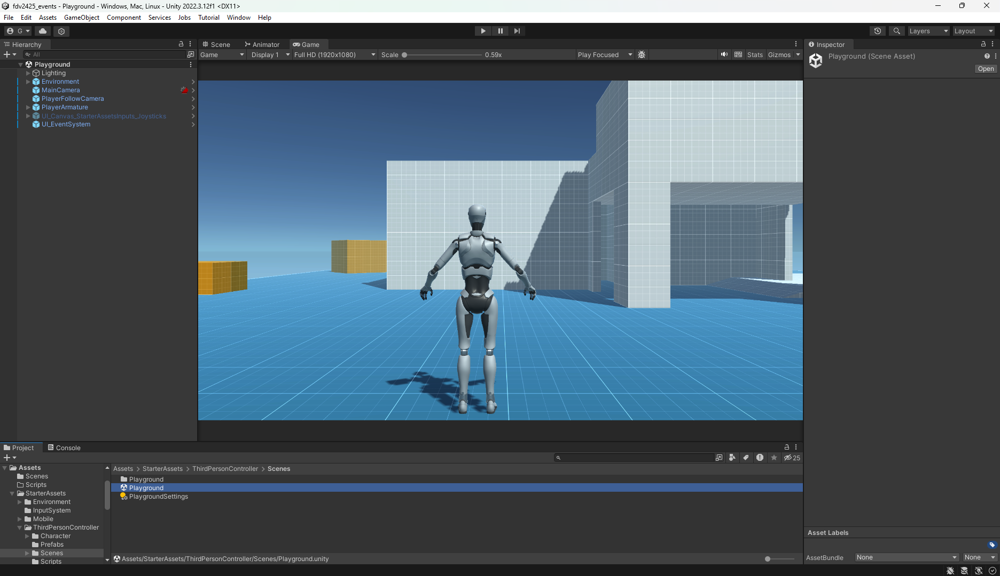
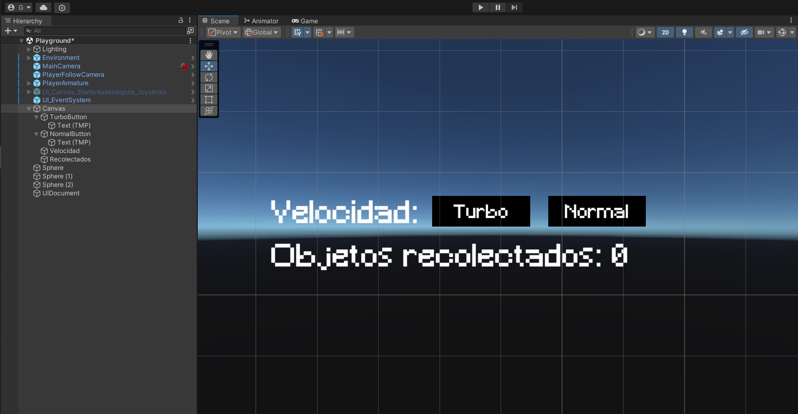
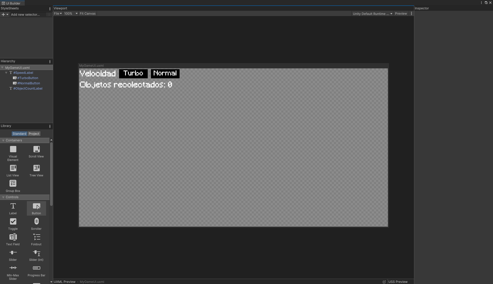

# Eventos
1. Implementar una UI que permita configurar con qué velocidad te moverás: turbo o normal. También debe mostar la cantidad de objetos recolectados y si chocas con alguno especial restar fuerza.

Para esta práctica se utilizará el paquete ThirdPerson de Standard Assets. Lo importamos al proyecto de la siguiente manera:

Y trabajaremos en la escena por defecto de este paquete.

Para crear la interfaz, crearemos un Canvas que contenga dos etiquetas y dos botones.

En el caso de UI Toolkit, los pasos son muy similares, creando dos Label y dos Button.

El script [GameUI.cs](scripts/GameUI.cs) se encarga de gestionar los eventos en los botones de manera que se modifica la velocidad del jugador según en qué boton se haya hecho clic.

Funcionamiento con Canvas:

Funcionamiento con UI Toolkit:

2. Agrega un personaje que al clickar sobre un botón de la UI se dirija hacia un objetivo estático en la escena.
3. Agregar a tu escena un objeto que al ser recolectado por el jugador haga que otros dos objetos en la escena realicen las siguientes acciones: el objeto A se desplaza hacia el jugador. El objeto B se ubica en un punto fijo en la escena.