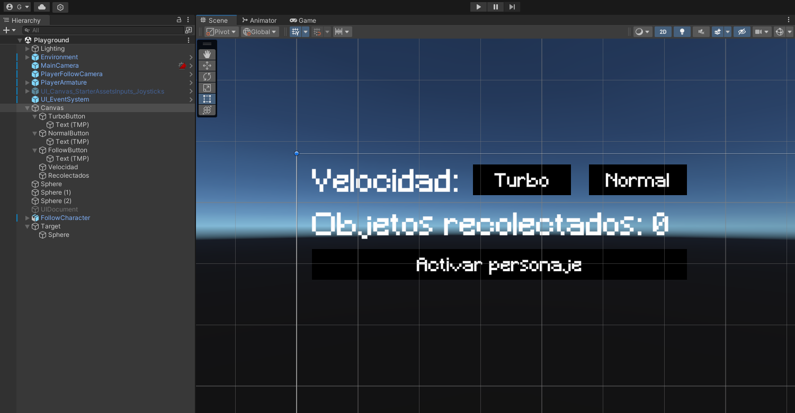
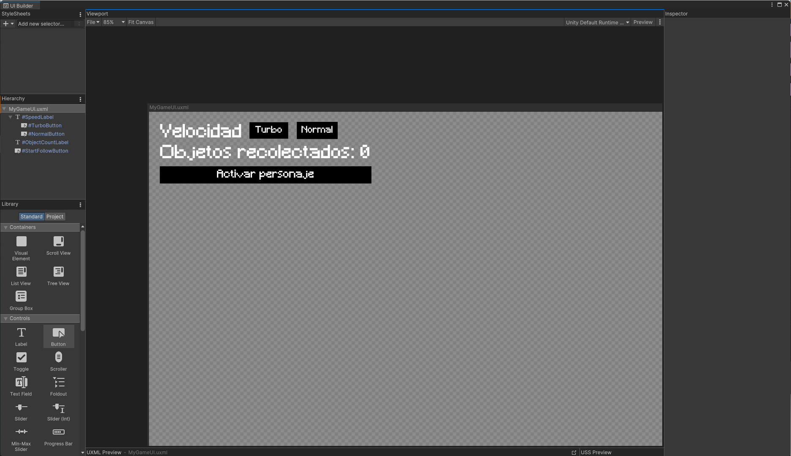

# Eventos
## 1. Implementar una UI que permita configurar con qué velocidad te moverás: turbo o normal. También debe mostar la cantidad de objetos recolectados y si chocas con alguno especial restar fuerza.

Para esta práctica se utilizará el paquete ThirdPerson de Standard Assets. Lo importamos al proyecto de la siguiente manera:

Y trabajaremos en la escena por defecto de este paquete.

Para crear la interfaz, crearemos un Canvas que contenga dos etiquetas y dos botones.

En el caso de UI Toolkit, los pasos son muy similares, creando dos Label y dos Button.

El script [GameUI.cs](scripts/GameUI.cs) y [GameUIToolkit.cs](scripts/GameUIToolkit.cs) se encarga de gestionar los eventos en los botones de manera que se modifica la velocidad del jugador según en qué boton se haya hecho clic. El script [CollectibleSphere.cs](scripts/CollectibleSphere.cs) se encarga de detectar colisiones con el jugador utilizando OnTriggerEnter, y si es de tipo malo (booleano slowsPlayer) se aplica una reducción a la velocidad de movimiento.

Funcionamiento con Canvas:

Funcionamiento con UI Toolkit:

## 2. Agrega un personaje que al clickar sobre un botón de la UI se dirija hacia un objetivo estático en la escena.

Primero, modificamos la interfaz, tanto nuestro Canvas como el documento UI Toolkit para añadir un botón (denominado Activar personaje) que se encargará de activar a nuestro personaje para que siga su objetivo definido.

Añadimos un script [FollowCharacter.cs](scripts/FollowCharacter.cs) que recibe un objetivo Transform y una velocidad de movimiento. Con su función StartFollowing comienza a seguir el objetivo. Creamos una esfera gris en la escena que actuará como el objetivo y conectamos el evento onClick del botón a esta función para que cuando sea pulsado el personaje comience a moverse hacia la esfera gris. Para ello se modifica [GameUI.cs](scripts/GameUI.cs) y [GameUIToolkit.cs](scripts/GameUIToolkit.cs)

Funcionamiento con Canvas:

Funcionamiento con UI Toolkit:

## 3. Agregar a tu escena un objeto que al ser recolectado por el jugador haga que otros dos objetos en la escena realicen las siguientes acciones: el objeto A se desplaza hacia el jugador. El objeto B se ubica en un punto fijo en la escena.

Añadimos un script [CollectibleCylinder.cs](scripts/CollectibleCylinder.cs) que recibe un objeto A de tipo FollowCharacter, y un objeto B de tipo Transform. Detectamos la colisión con el jugador utilizando OnTriggerEnter, y en caso de que ocurra activamos el comportamiento del objeto A y teletransportamos el objeto B a su objetivo, definido también como propiedad en el script.

Funcionamiento:

